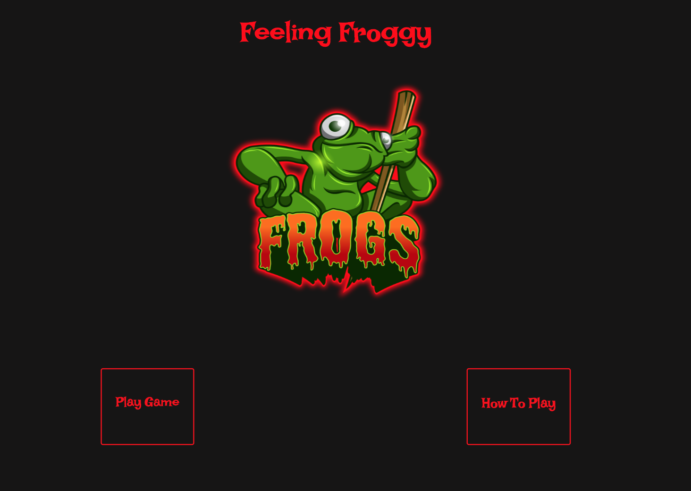
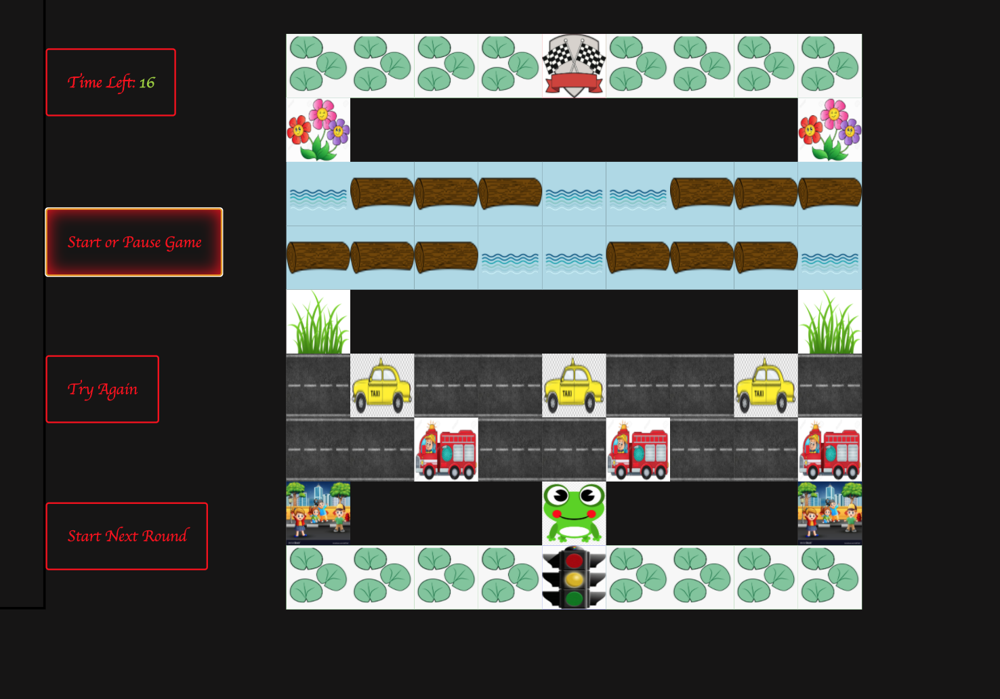

#Feeling Froggy Game

##Description
Feeling froggy is a simple game built in HTML, CSS, Javascript, and JQuery. It is played in the browser. It allows the player to use the arrow keys to maneuver across a road and a river to avoid obstacles.

Current version is MVP.

use this link to access: https://coachhoward.github.io/froggerproject/

##Screenshots:

##Installation
No special reqs for instalation

##Usage
Any age player is welcome. Content is safe for all ages

##Support
Pleae let me know if you need any assistance. Contact me at coachhoward/froggerproject on github.com Use the issue tracker or email me at choward@ownerfinancellc.com

##Roadmap
There are many updates that will be added in the future. The project is currently MVP. Lots of cool functionality to follow. This is a fun sideproject.

##Contributing
I am open to contribution to this project at a future date. Documentation on how to get started with contributions will be available on a future date.

##Code Quality
Lots of work to do on this game. This is just the start. No special setup is required.

##License all are welcome to use this documentation. 

##Project status
This product version 1.0 is MVP. I will add to the functionality in the future.
